<!-- Header Banner -->

  

<h1 align="center">Hi, I'm Faisal</h1>
<h3 align="center">Senior Mobile App Engineer | Flutter, Kotlin Multiplatform, Android, iOS</h3>

<!-- Unified contact links -->

  
  
  
  
  
  

<!-- CTA -->

  <b>Open to freelance mobile projects, senior mobile engineering roles, and long-term product partnerships.</b>

---

### About Me

I build production mobile applications for Android and iOS with Flutter, Kotlin Multiplatform, Kotlin, Jetpack Compose, SwiftUI, and Java, with a focus on products that need strong architecture, reliable releases, and long-term maintainability.

My work covers feature delivery, API integrations, monetization, app store releases, and production support across both public apps and private client platforms.

I have delivered `10+` published apps across Google Play and the App Store in finance, trading, lifestyle, productivity, and utility domains.

  <b>I build mobile products that are scalable, maintainable, and production ready.</b>

---

### Professional Experience

#### Senior Mobile App Engineer | ATRULE Technologies

- Led end-to-end mobile delivery across Flutter, Kotlin, Java, Jetpack Compose, and SwiftUI for Android and iOS products.
- Owned architecture setup, feature development, API integration, optimization, testing, release preparation, and production maintenance.
- Delivered commercial applications across finance, utility, ecommerce, charity, and business platforms for both public stores and private client use.
- Implemented monetization and engagement systems including subscriptions, in-app purchases, RevenueCat, AdMob, Google Pay, Apple Pay, and push notifications.
- Managed the full release lifecycle across Google Play, App Store submissions, hotfixes, OTA updates, and version maintenance.
- Collaborated with product managers, designers, backend engineers, QA, and clients to ship production-ready mobile products.

---

### Published Apps

  
  
  
  

#### Featured Shipped Apps

<table width="100%" style="width: 100%; table-layout: fixed;">
  <tr>
    <td align="center" width="33%">
        
      <strong>Pakistan Petrol Price Today</strong> 
      Live petrol price updates, fuel alerts, station locator, mileage tracking, and maintenance reminders.  
       
       
       
      
    </td>
    <td align="center" width="33%">
        
      <strong>STINU Position Size Calculator</strong> 
      Live position sizing and risk calculator for forex, commodities, and crypto trades.  
       
       
       
      
    </td>
    <td align="center" width="33%">
        
      <strong>Motorway Road Conditions Today</strong> 
      Real-time motorway conditions, fog alerts, weather updates, and route support for Pakistan.  
       
       
       
      
    </td>
  </tr>
  <tr>
    <td align="center" width="33%">
        
      <strong>Market Countdown Times &amp; News</strong> 
      Market session countdowns, economic news, bank holidays, widgets, and trading notifications.  
       
       
       
      
    </td>
    <td align="center" width="33%">
        
      <strong>FX Meter</strong> 
      Currency strength analysis app with daily expert updates and historical strength data.  
       
       
       
      
    </td>
    <td align="center" width="33%">
        
      <strong>Market Opens</strong> 
      Forex market open and close tracker with countdowns and time zone conversion.  
       
       
       
      
    </td>
  </tr>
</table>

#### Additional Published Apps

<table width="100%" style="width: 100%; table-layout: fixed;">
  <tr>
    <td align="center" width="33%">
        
      <strong>Pakistani Brands</strong> 
      Shopping app that brings Pakistani fashion brands, deals, and wishlists into one place.  
       
       
       
      
    </td>
    <td align="center" width="33%">
        
      <strong>Pakistan History Timeline</strong> 
      Pakistan history reference covering timelines, ideologies, politics, culture, and major events.  
       
       
       
      
    </td>
    <td align="center" width="33%">
        
      <strong>MarketBeats - Activity Monitor</strong> 
      Forex alert app for unusual market activity, high-probability moves, and pair/timeframe monitoring.  
       
       
       
      
    </td>
  </tr>
  <tr>
    <td align="center" width="33%">
        
      <strong>Kivora - Trading Mindset</strong> 
      Meditation app for traders focused on discipline, emotional control, and mental resilience.  
       
       
       
      
    </td>
    <td align="center" width="33%">
        
      <strong>Position Pal</strong> 
      Position size calculator for NYSE, NASDAQ, and index trades with shareable trade setups.  
       
       
       
      
    </td>
    <td align="center" width="33%">
        
      <strong>Moye Moye - Weather Fun</strong> 
      Real-time weather app that mixes accurate forecasts with humor-driven daily updates.  
       
       
       
      
    </td>
  </tr>
  <tr>
    <td align="center" width="33%">
        
      <strong>BrainEquity Track Your Habits</strong> 
      Habit tracker for traders with readiness scoring and pre-market and post-market routines.  
       
       
      
    </td>
    <td width="33%">&nbsp;</td>
    <td width="33%">&nbsp;</td>
  </tr>
</table>

---

### Client / Private Projects

#### Commerce, Property, Booking, and Delivery

<table style="width: 100%; table-layout: fixed;">
  <tr>
    <td align="center" width="33%">
      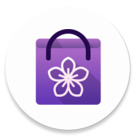 
      <strong>LylaCart</strong> 
      <em>Regional Shopping</em> 
      Multi-country shopping app with offers, carts, checkout, and order tracking.
    </td>
    <td align="center" width="33%">
       
      <strong>Furniture Store</strong> 
      <em>Furniture Shopping</em> 
      Browse furniture, save favourites, manage cart items, and place orders.
    </td>
    <td align="center" width="33%">
       
      <strong>Housing Organiser</strong> 
      <em>Property Finder</em> 
      Post and discover properties for selling, buying, and renting.
    </td>
  </tr>
  <tr>
    <td align="center">
       
      <strong>Beauty &amp; Service Booking</strong> 
      <em>Salon and Home Appointments</em> 
      Book salon, spa, barber, and at-home services with chat, maps, and reviews.
    </td>
    <td align="center">
       
      <strong>Fawry Delivery</strong> 
      <em>Order Delivery</em> 
      Customer, courier, and store flows for placing, assigning, and delivering orders.
    </td>
  </tr>
</table>

#### Business, Networking, and Admin

<table style="width: 100%; table-layout: fixed;">
  <tr>
    <td align="center" width="33%">
       
      <strong>BusiBeez</strong> 
      <em>Business Deals and Networking</em> 
      Business discovery app with ads, promotions, messaging, and deal workflows.
    </td>
    <td align="center" width="33%">
       
      <strong>Aajizz Admin</strong> 
      <em>Donation Admin</em> 
      Manage KYC, campaigns, users, finance activity, and withdrawal approvals.
    </td>
    <td align="center" width="33%">
      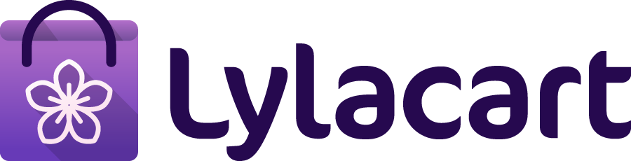 
      <strong>LylaCart Admin</strong> 
      <em>Retail Admin</em> 
      Handle products, categories, offers, orders, notifications, and analytics.
    </td>
  </tr>
  <tr>
    <td align="center">
      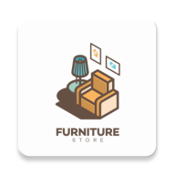 
      <strong>Furniture Store Admin</strong> 
      <em>Catalog Admin</em> 
      Upload products, manage images, and maintain the shared furniture catalog.
    </td>
    <td align="center">
       
      <strong>EPP Film Studio</strong> 
      <em>Production Asset Manager</em> 
      Manage film-production items, uploads, search, and export-ready records.
    </td>
    <td align="center">
      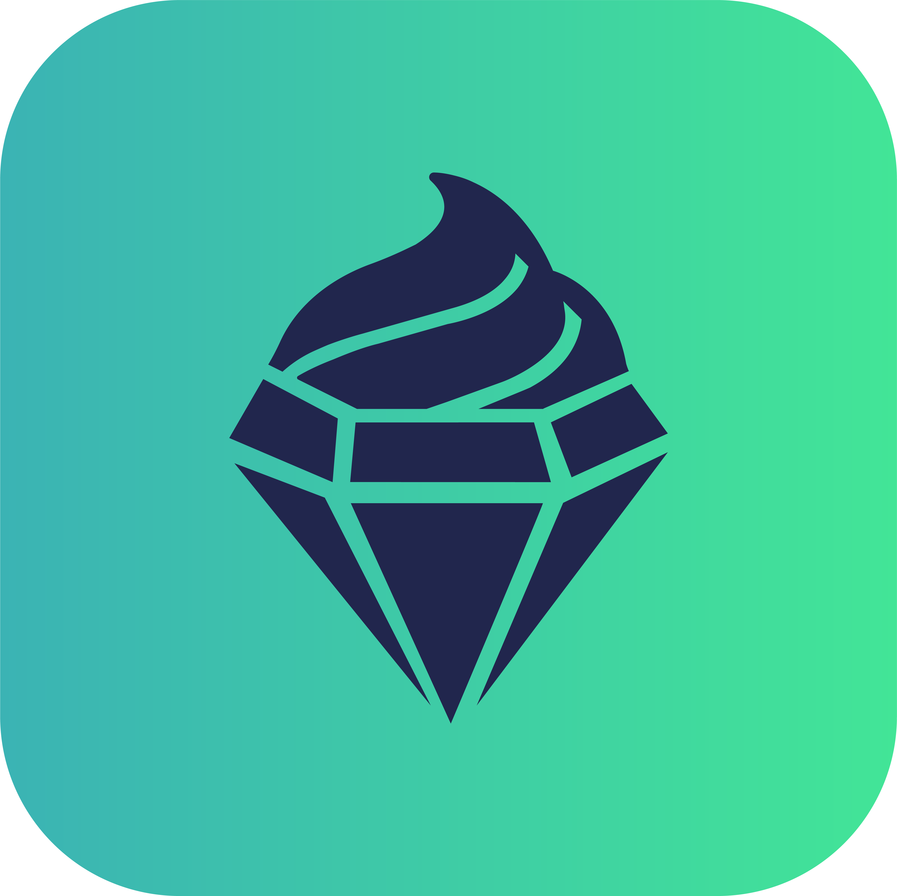 
      <strong>WEBATE Admin</strong> 
      <em>Hotel Admin</em> 
      Manage hotels, categories, menus, offers, events, and hotel-side operations.
    </td>
  </tr>
</table>

#### Care, Wellness, and Donations

<table style="width: 100%; table-layout: fixed;">
  <tr>
    <td align="center" width="33%">
       
      <strong>Private Elderly Care</strong> 
      <em>Caregiver Support</em> 
      Caregiver and employer onboarding with support tools, premium content, and service flows.
    </td>
    <td align="center" width="33%">
       
      <strong>Aajizz</strong> 
      <em>Donations and E-Stamps</em> 
      Donate through wallet funding, QR-based e-stamps, and transparent donation history.
    </td>
    <td align="center" width="33%">
       
      <strong>EatWell</strong> 
      <em>Meal Plans and Nutrition</em> 
      Personalized diet onboarding, meal planning, and food-service role workflows.
    </td>
  </tr>
</table>

#### Community, Dining, and Entertainment

<table style="width: 100%; table-layout: fixed;">
  <tr>
    <td align="center" width="33%">
       
      <strong>WEBATE</strong> 
      <em>Restaurant Offers and Events</em> 
      Discover restaurants, browse menus, redeem offers, and explore event listings.
    </td>
    <td align="center" width="33%">
       
      <strong>Hemisferio</strong> 
      <em>Resident Community</em> 
      Messaging, maintenance, buy-and-sell, notice boards, and resident services.
    </td>
    <td align="center" width="33%">
       
      <strong>Boom Entertainment</strong> 
      <em>Movies and Live TV</em> 
      Stream movies, originals, live TV, downloads, and subscription content.
    </td>
  </tr>
</table>

#### Safety and Sports

<table width="100%" style="width: 100%; table-layout: fixed;">
  <tr>
    <td align="center" width="33%" style="width: 33.33%;">
      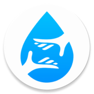 
      <strong>Man Overboard</strong> 
      <em>Emergency Rescue</em> 
      Report overboard emergencies with maps, weather visibility, and rescue coordination.
    </td>
    <td align="center" width="33%" style="width: 33.33%;">
       
      <strong>IPL Sports Guide</strong> 
      <em>Cricket Guides and Stats</em> 
      IPL guides, points tables, league references, and cricket statistics.
    </td>
    <td align="center" width="33%" style="width: 33.33%;">
&nbsp; &nbsp; &nbsp; &nbsp;
</td>
  </tr>
</table>

---

### Featured Repositories

  
  

  
  

  
  

---

## Client Reviews & Ratings

### Upwork Reviews

> He is a strong developer who completes things on time, a strong experienced flutter developer.

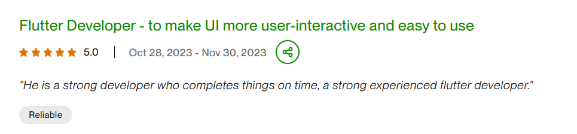

> Faisal was very good technically strong and delivered things on time. Good experience with flutter and mobile app development.

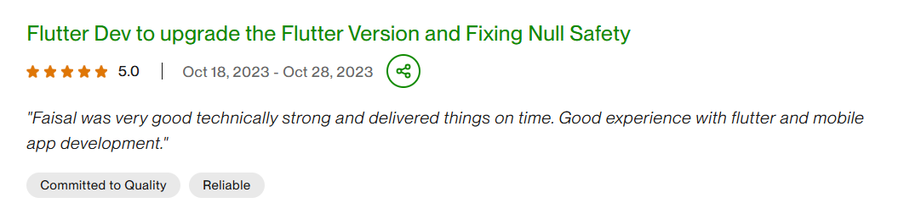

> I am good to work with Faisal Arshad. He is very good knowledge and experience.

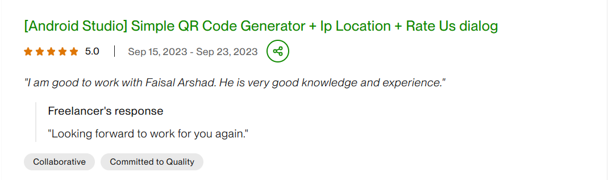

---

### Fiverr Reviews

> Outstanding experience. He solved all my problems on my app.

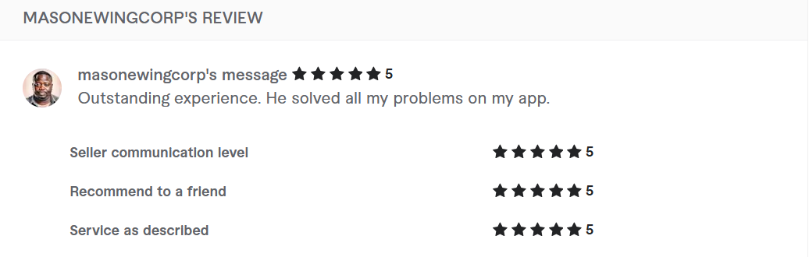

---

### LinkedIn Recommendations

> Collaborating with Faisal Arshad was a game changer. Their expertise in mobile app development and attention to detail elevated our project.

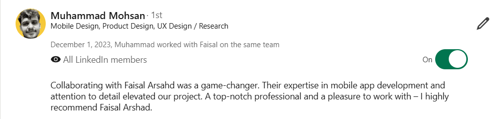

> Faisal is best android developer. He is well organized, diligent, and a fast learner.

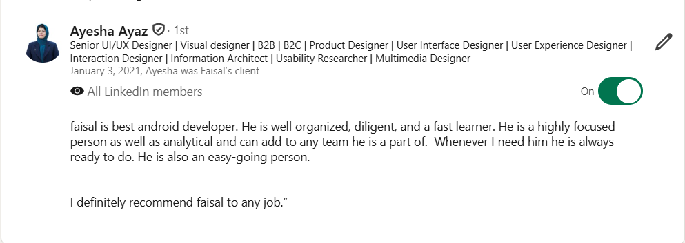

<b>More review screenshots can move into a dedicated testimonials page when this portfolio becomes a website.</b>

---

### Tech Stack

**Languages**

  
  
  
  

**Mobile Platforms**

  
  
  
  
  
  

**Architecture and Integrations**

  
  
  
  
  
  

**Monetization and Delivery**

  
  
  
  
  
  
  

**AI and Automation**

  
  
  
  

---

### GitHub Stats

  
  

---

### Open For Collaboration

I am available for freelance mobile app projects, senior mobile engineering roles, architecture support, and long-term product partnerships.

---

### Certifications

  
  

  <em>Certified in workflow automation, control flow, data mapping, and integration design using Make.com.</em>

---

  <em>Building mobile products that scale, perform, and last.</em>

