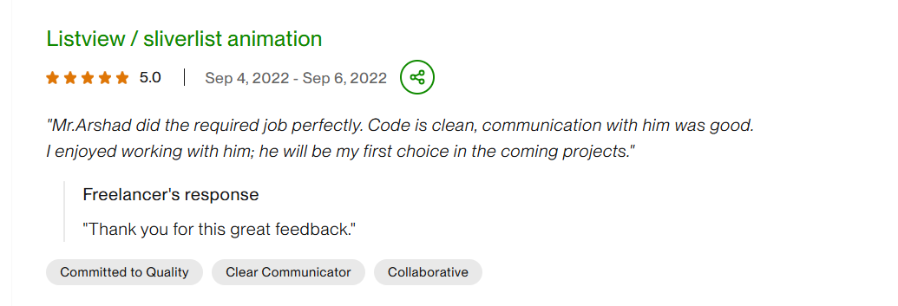
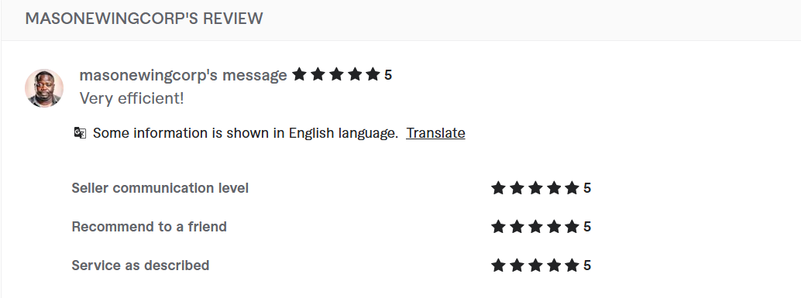

<!-- Header Banner -->

  

<!-- Animated typing tagline -->

  

<h1 align="center">👋 Hi, I’m Faisal</h1>
<h3 align="center">📱 Senior Mobile App Engineer | Flutter • Kotlin Multiplatform • Android • iOS</h3>

<!-- Social Links Row 1 -->

  
  
  
  

<!-- Freelance Platforms -->

  
  

<!-- Profile Badges -->

  
  
  

<!-- CTA -->

  📩 <b>Open to freelance projects, product collaborations, and senior mobile engineering opportunities</b>

---

### 👨‍💻 About Me

🚀 Senior Mobile App Engineer with **5+ years of experience** building **native and cross platform mobile applications** for Android and iOS using **Flutter, Kotlin Multiplatform, Kotlin, Jetpack Compose, SwiftUI, and Java**.

⚡ Strong background in **mobile architecture, feature development, REST APIs, Firebase integration, subscriptions, performance optimization, release cycles, and long term product maintenance**.

📱 Delivered **10+ production apps** on **Google Play and App Store** across **finance, trading, lifestyle, productivity, and utility products**.

💳 Hands on experience with **RevenueCat, push notifications, Firebase, Google Play Console, App Store Connect, third party SDKs, and monetization flows**.

🤖 Comfortable with modern AI assisted development using **ChatGPT, Codex, and Claude** for debugging, faster delivery, and technical problem solving.

🔁 Certified in **Make.com automation**, with practical experience in workflow automation and productivity systems.

  <b>✨ I build mobile products that are scalable, maintainable, and production ready.</b>

---

### 💼 Professional Experience

#### Senior Mobile App Engineer | ATRULE Technologies

📍 Worked on production mobile applications for Android and iOS across finance, utility, eCommerce, charity, and business platforms.

🚀 Led end to end mobile development using Flutter, Kotlin, Java, Jetpack Compose, and SwiftUI, covering architecture setup, feature development, API integration, testing, optimization, and store releases.

⚡ Built and maintained scalable applications with focus on clean architecture, reusable components, performance optimization, and long term maintainability.

🔗 Integrated REST APIs, Firebase services, WebSockets, push notifications, maps, subscriptions, and third party SDKs across multiple live products.

💳 Implemented monetization flows including in app purchases, RevenueCat subscriptions, Google Pay, Apple Pay, and AdMob integrations.

📦 Managed full release lifecycle including Play Store deployment, App Store submissions, production fixes, OTA updates, and version maintenance.

🤝 Collaborated closely with product managers, designers, backend engineers, QA teams, and clients to deliver production ready mobile solutions.

🏗 Delivered both public store apps and private client applications used in real business environments.

---

### 🧠 Engineering Highlights

📱 **Cross Platform & Native Apps**  
🏗 **Scalable Architecture**  
🔗 **Advanced Integrations**  
🚀 **Production Releases**  
🤝 **Commercial Delivery**

---

### 💻 Tech Stack

**🔤 Languages**

  
  
  
  

**📱 Mobile Frameworks & Platforms**

  
  
  
  
  
  

**🌀 State Management & Architecture**

  
  
  
  
  

**☁️ Backend, Data & Integrations**

  
  
  
  
  

**💰 Monetization & Engagement**

  
  
  
  

**💳 Payment Gateways**

  
  
  

**🧰 Tools, Release & DevOps**

  
  
  
  
  
  

**🤖 AI Assisted Development**

  
  
  

**📋 Workflow & Collaboration**

  
  
  

**🔁 Automation**

  

---

### 🚀 What I Can Build

📱 **Full Mobile Apps**  
🔧 **App Upgrades & Refactoring**  
☁️ **Backend & Firebase Integration**  
💳 **Subscriptions & Payments**  
⚡ **Realtime Features**  
🚀 **Store Releases & Optimization**

---

### 🎯 What Clients Usually Hire Me For

🚀 **Product Launches**  
🛠 **Codebase Upgrades**  
🔥 **Complex Bug Fixing**  
🔗 **System Integrations**  
📈 **Growth Ready Releases**

---

### 🌍 Product Domains

📈 **Finance & Trading**  
🛒 **Commerce & Retail**  
🧾 **Utilities & Everyday Apps**  
❤️ **Charity & Social Impact**  
📊 **Productivity & Tracking Tools**  
🏢 **Business Platforms**

---

### 📱 Published Apps  

  
  
  
  

  <table>
    <tr>
      <td align="center" width="33%">
         
        <strong>Pakistan Petrol Price Today</strong> 
        
          
        
        
      </td>
      <td align="center" width="33%">
         
        <strong>STINU Position Size Calculator</strong> 
        
          
        
        
      </td>
      <td align="center" width="33%">
         
        <strong>Motorway Road Conditions Today</strong> 
        
          
        
        
      </td>
    </tr>
    <tr>
      <td align="center" width="33%">
         
        <strong>Market Opens</strong> 
        
          
        
        
      </td>
      <td align="center" width="33%">
         
        <strong>Market Countdown Times & News</strong> 
        
          
        
        
      </td>
      <td align="center" width="33%">
         
        <strong>FX Meter</strong> 
        
          
        
        
      </td>
    </tr>
    <tr>
      <td align="center" width="33%">
         
        <strong>Pakistani Brands</strong> 
        
          
        
        
      </td>
      <td align="center" width="33%">
         
        <strong>Pakistan History Timeline</strong> 
        
          
        
        
      </td>
      <td align="center" width="33%">
         
        <strong>MarketBeats – Activity Monitor</strong> 
        
          
        
        
      </td>
    </tr>
    <tr>
      <td align="center" width="33%">
         
        <strong>Kivora – Trading Mindset</strong> 
        
          
        
        
      </td>
      <td align="center" width="33%">
         
        <strong>Position Pal</strong> 
        
          
        
        
      </td>
      <td align="center" width="33%">
         
        <strong>Moye Moye – Weather Fun</strong> 
        
          
        
        
      </td>
    </tr>
    <tr>
      <td align="center">
         
        <strong>BrainEquity Track Your Habits</strong> 
        
          
        
        
      </td>
    </tr>
  </table>

---

### 🔒 Client / Private Projects  

#### Commerce & Marketplace

<table width="100%" style="table-layout: fixed;">
  <tr>
    <td align="center" width="33%">
       
      <strong>LylaCart Shopping Suite</strong> 
      <em>Regional E-Commerce</em> 
      Current and legacy LylaCart shopping builds for localized catalog and checkout flows.
    </td>
    <td align="center" width="33%">
       
      <strong>Furniture Store Android App</strong> 
      <em>Furniture E-Commerce</em> 
      Catalog, favourites, cart, and order history.
    </td>
    <td align="center" width="33%">
       
      <strong>Housing Organiser</strong> 
      <em>Real Estate Marketplace</em> 
      Property listing flows for selling and renting.
    </td>
  </tr>
  <tr>
    <td align="center">
       
      <strong>Private Elderly Care</strong> 
      <em>Caregiving / Premium Marketplace</em> 
      Caregiving, premium video, and marketplace features.
    </td>
    <td align="center">
       
      <strong>Virtual Garage</strong> 
      <em>Driver / Tracking App</em> 
      Driver auth, OTP, and location tracking.
    </td>
    <td align="center"></td>
  </tr>
</table>

#### Business & Admin Platforms

<table width="100%" style="table-layout: fixed;">
  <tr>
    <td align="center" width="33%">
       
      <strong>BusiBeez Platform</strong> 
      <em>Business Networking / Deals</em> 
      Main and internal BB mobile builds for ads, messaging, promotions, and deal workflows.
    </td>
    <td align="center" width="33%">
       
      <strong>Client Book-Up Android</strong> 
      <em>Booking / Service Marketplace</em> 
      Appointments, chat, maps, and payments.
    </td>
    <td align="center" width="33%">
       
      <strong>Aajizz Admin App</strong> 
      <em>Admin / KYC & Campaign Ops</em> 
      KYC, campaigns, users, and withdrawals.
    </td>
  </tr>
  <tr>
    <td align="center">
       
      <strong>LylaCart Admin Suite</strong> 
      <em>Admin / Commerce Ops</em> 
      Current and legacy LylaCart admin dashboards for products, orders, ads, and analytics.
    </td>
    <td align="center">
       
      <strong>Furniture Store Android Admin</strong> 
      <em>Admin / Catalog Management</em> 
      Product uploads and Firebase catalog control.
    </td>
    <td align="center">
       
      <strong>EPP Film Production App</strong> 
      <em>Internal Content Management</em> 
      Catalogs, uploads, search, and exports.
    </td>
  </tr>
  <tr>
    <td align="center">
       
      <strong>WEBATE Admin App</strong> 
      <em>Hospitality Admin / Hotel Ops</em> 
      Hotels, menus, offers, and events.
    </td>
    <td align="center">
       
      <strong>Fawry Delivery Platform</strong> 
      <em>Commerce / Delivery Platform</em> 
      Modular user, delegate, store, chat, and order flows.
    </td>
    <td align="center"></td>
  </tr>
</table>

#### Finance, Utility & Productivity

<table width="100%" style="table-layout: fixed;">
  <tr>
    <td align="center" width="33%">
       
      <strong>Aajizz Mobile App</strong> 
      <em>Donations / QR E-Stamps</em> 
      Wallet donations with QR e-stamps.
    </td>
    <td align="center" width="33%">
       
      <strong>EatWell App</strong> 
      <em>Nutrition / Meal Planning</em> 
      Diet onboarding and meal plan prototype.
    </td>
    <td align="center" width="33%">
       
      <strong>QR Code Generator Android App</strong> 
      <em>Utility / QR + WebView</em> 
      Text-to-QR generation with fallback WebView.
    </td>
  </tr>
  <tr>
    <td align="center">
       
      <strong>LinkedIn Post Fetcher</strong> 
      <em>Utility / Content Extraction</em> 
      Fetches LinkedIn post text quickly.
    </td>
    <td align="center">
       
      <strong>Faisal Upwork Assistant</strong> 
      <em>Browser Extension / Upwork</em> 
      Proposal helper for a single profile.
    </td>
    <td align="center">
       
      <strong>Upwork Job Insights Team Extension</strong> 
      <em>Browser Extension / Shared Workflow</em> 
      Scoring, alerts, and AI proposal support.
    </td>
  </tr>
</table>

#### Media, Community & Discovery

<table width="100%" style="table-layout: fixed;">
  <tr>
    <td align="center" width="33%">
       
      <strong>Boom Entertainment</strong> 
      <em>OTT Streaming / Live TV</em> 
      Movies, live TV, downloads, and subscriptions.
    </td>
    <td align="center" width="33%">
       
      <strong>Hemisferio Android App</strong> 
      <em>Community / Resident Services</em> 
      Resident messaging and society services.
    </td>
    <td align="center" width="33%">
       
      <strong>WEBATE Android App</strong> 
      <em>Hospitality / Restaurant Discovery</em> 
      Restaurants, offers, events, and QR redemption.
    </td>
  </tr>
  <tr>
    <td align="center">
       
      <strong>Sports Android App</strong> 
      <em>Sports / Cricket Guide</em> 
      IPL guides, stats, and tables.
    </td>
    <td align="center">
       
      <strong>Man Overboard Android App</strong> 
      <em>Safety / Rescue Reporting</em> 
      Maps, weather, and rescue reporting.
    </td>
    <td align="center"></td>
  </tr>
</table>

#### Education & Assessment

<table width="100%" style="table-layout: fixed;">
  <tr>
    <td align="center" width="33%">
       
      <strong>Exam Hub Online Assessment</strong> 
      <em>Education / Exams</em> 
      Admin, teacher, and student exam flows.
    </td>
    <td align="center" width="33%"></td>
    <td align="center" width="33%"></td>
  </tr>
</table>

---
## ⭐ Client Reviews & Ratings

###  Upwork

⭐⭐⭐⭐⭐ **5.0 Rated**

> He is a strong developer who completes things on time, a strong experienced flutter developer.

⭐⭐⭐⭐⭐ **5.0 Rated**

> Faisal was very good technically strong and delivered things on time. Good experience with flutter and mobile app development.

⭐⭐⭐⭐⭐ **5.0 Rated**

> I am good to work with Faisal Arshad. He is very good knowledge and experience.

⭐⭐⭐⭐⭐ **5.0 Rated**

> Mr. Arshad did the required job perfectly. Code is clean, communication with him was good. I enjoyed working with him, he will be my first choice in the coming projects.

---

###  Fiverr

⭐⭐⭐⭐⭐ **5.0 Rated**

> Outstanding experience. He solved all my problems on my app.

⭐⭐⭐⭐⭐ **5.0 Rated**

> Very efficient!

---

###  LinkedIn

⭐⭐⭐⭐⭐ **Professional Recommendation**

> Collaborating with Faisal Arshad was a game changer. Their expertise in mobile app development and attention to detail elevated our project.

⭐⭐⭐⭐⭐ **Professional Recommendation**

> Faisal is best android developer. He is well organized, diligent, and a fast learner.

---

### 📌 Featured Repositories

  
  

  
  

  
  

---

### 📊 GitHub Stats

  
  

  

  

---

### 🌐 Open For Collaboration

🚀 Freelance Mobile Projects  
🤝 Long Term Product Partnerships  
📱 Senior Mobile Engineering Roles  
🔧 Architecture & Release Support

---

### 🏆 Certifications

  
  

  <em>✅ Certified in <b>workflow automation</b>, <b>control flow</b>, <b>data mapping</b>, and <b>integration design</b> using Make.com.</em>

  <em>🔁 Practical experience building automation workflows to improve productivity and reduce manual operations.</em>

---

  <em>Building mobile products that scale, perform, and last.</em>

